# MiroFish Agent Research Plan — Comprehensive Engineering Analysis

> **Source**: [MiroFish Agent Research Plan.docx](file:///c:/Users/hp/Downloads/AI_Testing_Suites/Multi_Agentic_Testaing_V1/MiroFish%20Agent%20Research%20Plan.docx)
> **Document Title**: *Comprehensive Architectural and Theoretical Analysis of the MiroFish Swarm Intelligence Prediction Engine*
> **Analysis Date**: March 18, 2026

---

## Table of Contents

1. [Executive Summary](#1-executive-summary)
2. [Section-by-Section Detailed Walkthrough](#2-section-by-section-detailed-walkthrough)
3. [System Architecture Diagram](#3-system-architecture-diagram)
4. [Five-Phase Operational Pipeline Flowchart](#4-five-phase-operational-pipeline-flowchart)
5. [Agent Taxonomy & Analysis](#5-agent-taxonomy--analysis)
6. [Methods & Techniques Deep Dive](#6-methods--techniques-deep-dive)
7. [Theoretical Foundations: Path Integral Mapping](#7-theoretical-foundations-path-integral-mapping)
8. [Technical Vulnerability Analysis](#8-technical-vulnerability-analysis)
9. [OASIS Engine Architecture](#9-oasis-engine-architecture)
10. [BettaFish Precursor Ecosystem](#10-bettafish-precursor-ecosystem)
11. [Development & Methodology Analysis](#11-development--methodology-analysis)
12. [Adversarial Risk & Epistemic Limitations](#12-adversarial-risk--epistemic-limitations)
13. [Key Metrics & Statistics](#13-key-metrics--statistics)

---

## 1. Executive Summary

MiroFish is an **open-source multi-agent swarm intelligence engine** that fundamentally departs from traditional quantitative prediction models. Instead of treating markets and societies as mathematical equations, it constructs **high-fidelity digital sandboxes** populated by thousands of autonomous AI agents that interact, debate, form coalitions, and exhibit herd behavior—allowing macro-level predictions to **emerge organically** from micro-level agent interactions.

### Key Facts at a Glance

| Attribute | Value |
|---|---|
| **Creator** | Guo Hangjiang (senior, Beijing Univ. of Posts & Telecom) |
| **Development Time** | 10 days via "Vibe Coding" |
| **GitHub Stars** | 30,000+ |
| **Investment** | ¥30M (~$4.1M USD) from Shanda Group's Chen Tianqiao |
| **Max Agent Scale** | 1,000,000 agents (via OASIS) |
| **Agent Actions** | 23 distinct social operations |
| **Simulation Platforms** | Dual: Twitter/X + Reddit archetypes |
| **Core LLM** | OpenAI SDK-compatible (Qwen-plus recommended) |
| **License** | Open-source |

> [!IMPORTANT]
> The document's central thesis: **The future of analytics lies not in calculating numbers, but in simulating the complex, emergent behaviors of intelligent swarms.**

---

## 2. Section-by-Section Detailed Walkthrough

### Section 1: The Epistemological Shift in Predictive Modeling

**What it covers**: The foundational philosophical argument for why MiroFish exists.

**Detailed Analysis**:
- **Problem Statement**: Traditional predictive systems (quantitative finance, macroeconomic forecasting, PR) treat input variables as **static mathematical equations** and assume market participants are **rational entities** responding linearly to price signals.
- **Critical Failure**: These models cannot capture **cascading effects** of human irrationality, peer influence, and herd behavior. Panic selling, rapid narrative spread, and social contagion routinely defy linear assumptions.
- **MiroFish's Answer**: Treat prediction as a **sociological simulation** rather than mathematical extrapolation. Grant individual agents distinct personalities, memories, and behavioral constraints. The system models:
  - Contagion of fear
  - Crystallization of group polarization
  - Organic formation of social narratives
- **Key Paradigm**: Transition from **declarative prediction** → **emergent simulation** (described as *"SimCity meets AI forecasting"*).

### Section 2: Theoretical Foundations — The Social Path Integral

**What it covers**: A rigorous physics analogy mapping the engine to Feynman's path integral formulation.

**Detailed Analysis**:
- Draws a direct analogy between **quantum mechanics path integrals** and the MiroFish simulation.
- In Feynman's formulation, a particle's trajectory is computed by **summing over ALL possible paths**, each weighted by `e^(iS/ℏ)`.
- After **Wick rotation**, this becomes a **statistical partition function**, and Monte Carlo methods sample the configuration space.
- MiroFish operationalizes this: thousands of agents running through **parallel simulation branches** with varied interactions = **massive Monte Carlo sampling over social phase space**.
- Future capabilities unlocked by this framework:
  - **Effective action** → compressed model of dominant social behaviors
  - **Saddle-point approximation** → most probable social trajectory + distribution of alternatives
  - **Phase transitions** → minute seed condition changes causing drastically different outcomes

### Section 3: Core Technical Architecture and Dependency Stack

**What it covers**: The technology stack powering the system.

**Detailed Analysis**:
- **Backend**: Python 3.11-3.12, `uv` package manager
- **Frontend**: Vue.js on Node.js 18+
- **Deployment**: Docker/Docker Compose (port 3000 frontend, port 5001 backend API)
- Five core architectural components: Cognitive Engine (LLM), Simulation Framework (OASIS), Knowledge Structuring (GraphRAG), Memory Persistence (Zep Cloud), Deployment Infrastructure (Docker)
- **Critical Constraint**: Heavy reliance on third-party API endpoints introduces significant cost and latency. Every agent independently evaluates, consults memory, and generates a response per "tick", causing **exponential token scaling**.
- **Recommendation**: Start with <40 rounds for cost management.

### Section 4: BettaFish Precursor Ecosystem

**What it covers**: The data-gathering layer that provides seed data to MiroFish.

**Detailed Analysis**:
- **BettaFish (微舆)** = multi-agent public opinion analysis system covering 30+ social media platforms globally.
- Forms a **closed-loop intelligence ecosystem**: BettaFish extracts current sentiment → MiroFish projects it forward through simulated time.
- Uses **5 specialized agent archetypes** collaborating via an "Agent Forum" debate mechanism under a Moderator Agent.
- **Hallucination Case Study**: When BettaFish's data crawler (MindSpider) was disabled during a test, the Insight Agent fabricated fake maintenance costs (480 RMB/hour), invented government leaks, and created fictitious hardware issues. This proves: **garbage in = flawlessly predicted garbage universe**.

### Section 5: The Five-Stage Operational Pipeline

**What it covers**: The end-to-end simulation workflow.

**Phases** (detailed in [Section 4 Flowchart](#4-five-phase-operational-pipeline-flowchart)):
1. **Data Ingestion & GraphRAG Construction** — Structured knowledge graph from raw seed material
2. **Environment Setup & Agent Spawning** — Persona generation from the graph topology
3. **Dual-Platform Parallel Simulation** — Twitter/X + Reddit concurrent runs via OASIS
4. **Analytical Synthesis & Report Generation** — ReportAgent extracts macro observables
5. **Deep Human-in-the-Loop Interaction** — "God's-eye view" + asynchronous state interrupts

### Section 6: OASIS Simulation Engine

**What it covers**: The underlying simulation framework enabling million-agent scale.

**Detailed Analysis**:
- Built by **CAMEL-AI** research team, open-source.
- Overcomes two historical ABM limitations: rigid rule-based agents AND resource-heavy early LLM-ABMs limited to dozens of agents.
- **Scalable Inferencer** architecture distributes GPU loads for massive parallel processing.
- **23 distinct social actions**: follow, quote-post, repost, comment, build/sever connections, etc.
- Integrates **algorithmic recommendation systems** (interest-based + hot-score-based) mirroring real platform curation.
- Empirically validated: larger populations → more diverse, statistically significant opinion shifts.

### Section 7: Vibe Coding & The Super-Individual

**What it covers**: The development methodology and its industry implications.

**Detailed Analysis**:
- **Vibe Coding**: Developer articulates architectural intent via natural language; AI autonomously drafts, structures, and implements the codebase.
- Developer role shifts: from line-by-line code writing → **high-level system architect** validating through outcome observation.
- **Super-Individual Theory** (championed by investor Chen Tianqiao): a single creative operator can execute projects previously requiring entire enterprise teams.
- Empirical proof: One solo university student built a platform surpassing trending metrics of OpenAI, Google, and Microsoft products.

### Section 8: Empirical Applications

**What it covers**: Real-world demonstrations of the engine.

**Case 1 — Literary Forecasting**:
- Fed the first 80 chapters (~hundreds of thousands of words) of *Dream of the Red Chamber* into MiroFish
- GraphRAG mapped the Jia clan's familial/romantic/political relationships
- Engine generated probabilistic reconstructions of the lost original ending
- Community discussions on using it to generate entire Wuxia novels

**Case 2 — Macroeconomic Simulation**:
- Modeled systemic market reaction to a Federal Reserve interest rate hike
- Populated environment with institutional participants, market analysts, retail investors
- Tracked real-time spread of panic across simulated social platforms
- Identified convergence points of group sentiment

### Section 9: Technical Vulnerabilities

**What it covers**: Critical bugs and infrastructure challenges from the GitHub issue tracker.

Five major vulnerability categories documented (see [Section 8 table](#8-technical-vulnerability-analysis)).

### Section 10: Epistemic Limitations & Adversarial Risks

**What it covers**: Fundamental philosophical constraints and weaponization potential.

**Key Limitations**:
- "The map is not the territory" — agents are not actual humans
- All agent behavior inherits systemic biases and safety filters from LLM training data
- Cannot capture genuine novelty or truly irrational off-model reactions

**Adversarial Risks**:
- Engine functions as a **weaponization testing ground** for psychological operations
- Malicious actors could use it to optimize disinformation campaigns before live deployment

---

## 3. System Architecture Diagram

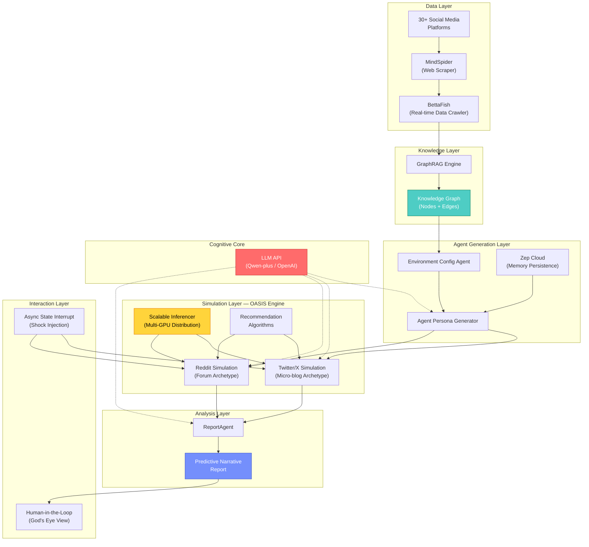

---

## 4. Five-Phase Operational Pipeline Flowchart

```mermaid
flowchart TD
    START(["🚀 Simulation Initiated"])

    subgraph Phase1["Phase 1: Data Ingestion & GraphRAG"]
        P1A["Ingest seed material<br/>(news, reports, memos, literature)"]
        P1B["Extract entities<br/>(people, corps, govts, concepts)"]
        P1C["Map interdependencies<br/>& relationships"]
        P1D["Output: Structured<br/>Knowledge Graph"]
    end

    subgraph Phase2["Phase 2: Environment Setup & Agent Spawning"]
        P2A["Environment Config Agent<br/>reads knowledge graph"]
        P2B["Generate thousands of<br/>distinct agent personas"]
        P2C["Assign: backstory, personality,<br/>behavioral constraints, biases"]
        P2D["Inject long-term memory<br/>via Zep Cloud"]
    end

    subgraph Phase3["Phase 3: Dual-Platform Parallel Simulation"]
        P3A["Launch Twitter/X<br/>simulation environment"]
        P3B["Launch Reddit<br/>simulation environment"]
        P3C["Agents perform 23<br/>social actions freely"]
        P3D["Dynamic temporal<br/>memory updates"]
        P3E["Opinions shift via peer<br/>influence & social contagion"]
    end

    subgraph Phase4["Phase 4: Analytical Synthesis"]
        P4A["ReportAgent deployed"]
        P4B["Track sentiment<br/>convergence points"]
        P4C["Isolate opinion<br/>trajectories"]
        P4D["Document coalition<br/>formation/dissolution"]
        P4E["Output: Predictive<br/>Narrative Report"]
    end

    subgraph Phase5["Phase 5: Human-in-the-Loop"]
        P5A["Preserve active<br/>simulation state"]
        P5B["User gets God's-eye<br/>view of sandbox"]
        P5C["Direct conversation<br/>with any agent"]
        P5D["Inject exogenous<br/>macro-variables"]
        P5E["Observe real-time<br/>social fallout"]
    end

    START --> P1A --> P1B --> P1C --> P1D
    P1D --> P2A --> P2B --> P2C --> P2D
    P2D --> P3A & P3B
    P3A & P3B --> P3C --> P3D --> P3E
    P3E --> P4A --> P4B --> P4C --> P4D --> P4E
    P4E --> P5A --> P5B --> P5C
    P5B --> P5D --> P5E
    P5E -.->|"Re-simulate"| P3C

    style Phase1 fill:#e3f2fd,stroke:#1565c0
    style Phase2 fill:#e8f5e9,stroke:#2e7d32
    style Phase3 fill:#fff3e0,stroke:#e65100
    style Phase4 fill:#f3e5f5,stroke:#6a1b9a
    style Phase5 fill:#fce4ec,stroke:#b71c1c
```

---

## 5. Agent Taxonomy & Analysis

### 5.1 MiroFish Core Agents

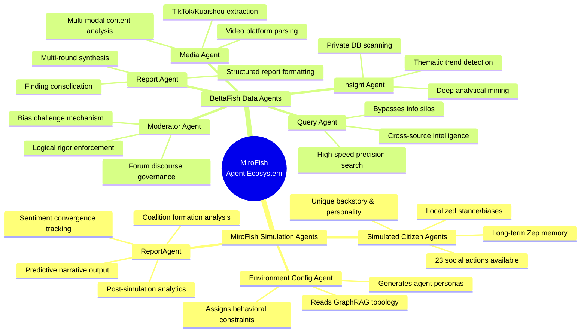

### 5.2 Complete Agent Registry

| # | Agent | System | Role | Key Capabilities |
|---|---|---|---|---|
| 1 | **Environment Config Agent** | MiroFish | Orchestrator | Reads knowledge graph, designs simulation parameters, spawns agent population |
| 2 | **Simulated Citizen Agents** (×1000s) | MiroFish | Actors | Post, debate, form coalitions, exhibit herd behavior; each has unique persona, memory, and constraints |
| 3 | **ReportAgent** | MiroFish | Analyst | Interrogates post-simulation state, extracts macro observables, generates narrative reports |
| 4 | **Insight Agent** | BettaFish | Data Miner | Deep analysis of corporate DBs and opinion repositories for underlying trends |
| 5 | **Media Agent** | BettaFish | Content Analyst | Multi-modal extraction from video-heavy platforms (TikTok, Kuaishou) |
| 6 | **Query Agent** | BettaFish | Intelligence Gatherer | High-speed cross-source web search across domestic and international sources |
| 7 | **Report Agent** | BettaFish | Synthesizer | Compiles multi-round debate outputs into structured comprehensive reports |
| 8 | **Moderator Agent** | BettaFish | Governor | Supervises Agent Forum debate, ensures logical rigor, challenges assumptions |

### 5.3 Agent Interaction Pattern

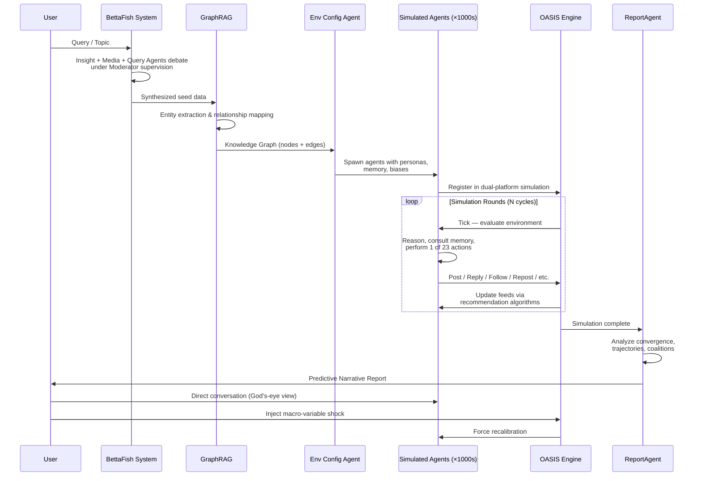

---

## 6. Methods & Techniques Deep Dive

### 6.1 Techniques Taxonomy

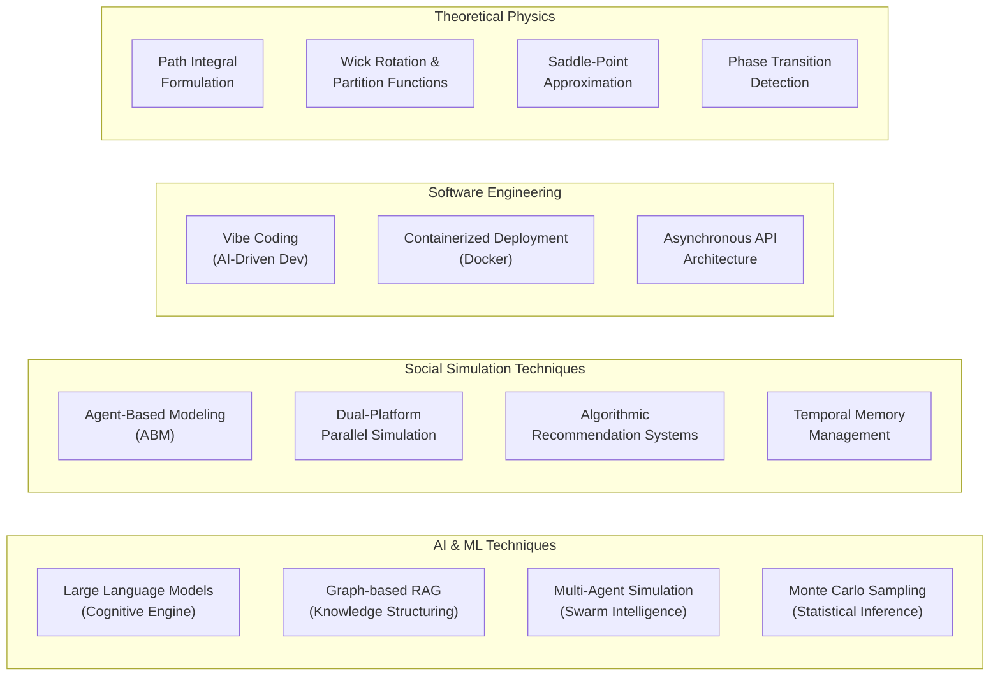

### 6.2 Detailed Methods Matrix

| Method/Technique | Domain | How MiroFish Uses It | Purpose |
|---|---|---|---|
| **GraphRAG** | Knowledge Engineering | Parses seed data into entity-relationship knowledge graphs instead of flat vector chunks | Establishes structural reality and boundary conditions; agents understand *who is connected to whom and why* |
| **Monte Carlo Sampling** | Statistical Physics | Parallel simulation runs with varied agent interactions across dual platforms | Samples diverse interaction pathways to find highest-probability sociological outcomes |
| **Path Integral Analogy** | Theoretical Physics | All possible agent interaction sequences = all possible particle trajectories | Mathematical foundation validating that macro-social outcomes can be computed by summing micro-interaction pathways |
| **Agent-Based Modeling** | Computational Sociology | Thousands of autonomous agents with distinct personas, not rule-based but LLM-powered | Models emergent phenomena (contagion, polarization, herd behavior) rather than prescriptive outputs |
| **Dual-Platform Simulation** | Social Network Analysis | Concurrent Twitter/X (fast, micro-blog) + Reddit (long-form, community) environments | Mimics real-world discourse fragmentation, echo chambers, and varied pacing |
| **Temporal Memory Injection** | Cognitive Architecture | Zep Cloud maintains per-agent and collective memory across rounds | Ensures consistency: agents remember grudges, alliances, and evolve coherently |
| **Algorithmic Recommendation** | Information Retrieval | Interest-based + hot-score-based content curation within simulation | Mirrors real platform behavior to determine what content goes viral |
| **Asynchronous State Interrupt** | Experimental Design | Inject exogenous macro-variables (rate cuts, CEO resignations) mid-simulation | Enables controlled sociological experiments impossible in the real world |
| **Agent Forum Debate** | Multi-Agent Collaboration | BettaFish specialist agents debate under Moderator supervision | Mitigates LLM homogenization, challenges assumptions, improves data quality |
| **Vibe Coding** | Software Development | Natural language architectural direction → AI generates the codebase | Enables solo developer to build complex multi-framework system in 10 days |
| **Effective Action Extraction** | Field Theory | Distill compressed model of dominant behaviors from simulation results | Outputs not just narrative but an "effective social dynamics" algorithm |
| **Phase Transition Detection** | Statistical Mechanics | Identify where minute seed changes cause qualitatively different outcomes | Maps "tipping points" in public opinion, analogous to water→ice transitions |
| **Scalable Inferencer** | Distributed Computing | OASIS proprietary architecture for multi-GPU load distribution | Enables 1M+ agent simulations without computational bottleneck |

---

## 7. Theoretical Foundations: Path Integral Mapping

### Mapping Table

| Physics Concept | MiroFish Mechanism | Systemic Implication |
|---|---|---|
| **All possible trajectories** | All possible agent interaction sequences | Boundless variations of how narratives/sentiments spread through the sandbox |
| **Action (S)** | Agent personality, memory, behavioral constraints | Localized rules governing individual decisions — the weighting function for probable actions |
| **Macroscopic observable** | Emergent prediction & synthesized report | The macro-state emerging after integrating out micro-fluctuations of individual agents |
| **Boundary conditions** | Injected seed material (news, reports) | Constrains the region of social phase space being sampled — the starting reality |
| **Monte Carlo sampling** | Parallel simulation runs across dual platforms | Core mechanism sampling diverse pathways to find highest-probability outcomes |
| **Effective action Γ** | Compressed dominant behavior model | Encodes dominant behavior after integrating out minor fluctuations |
| **Saddle-point approximation** | Most probable social trajectory | Identifies the dominant narrative path + distribution of alternatives |
| **Phase transitions** | Tipping points in public opinion | Minute initial changes → qualitatively different emergent outcomes |

### Mathematical Workflow

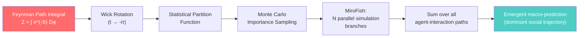

---

## 8. Technical Vulnerability Analysis

### Vulnerability Registry

| ID | Vulnerability | Severity | Manifestation | Root Cause | Proposed Fix |
|---|---|---|---|---|---|
| **#218** | Document Upload Halts | 🔴 Critical | Frontend freezes on "Uploading and analyzing docs..." | Docker misconfig: frontend calls `localhost` instead of server IP | Manual `VITE_API_BASE_URL` ENV config |
| **#217/#220** | Batch Interview Failures | 🔴 Critical | HTTP 400 on Step 5 (Deep Interaction) | Session timeout or string/integer type mismatch in agent ID payloads | Strict session state management + type validation |
| **#236** | Execution State Freezes | 🟡 High | Generic "Error" status, no diagnostics | Malformed LLM API endpoints (missing `/v1` suffix) or auth rejections | Frontend error propagation + endpoint validation |
| **#235** | Memory Architecture Lock-in | 🟡 High | Exclusive Zep Cloud dependency, privacy concerns | No native self-hosted graph DB integration | Integrate Neo4j or Graphiti for air-gapped deployment |
| **#210** | No Internationalization | 🟠 Medium | UI restricted to Chinese despite global trending | Missing i18n framework | Implement Vue I18n 9 with localized JSON + fallback policies |
| **—** | API Cost Explosion | 🔴 Critical | Exponential token consumption at scale | Every agent independently reasons per tick | Start with <40 rounds; optimize token batching |

### Vulnerability Impact Flow

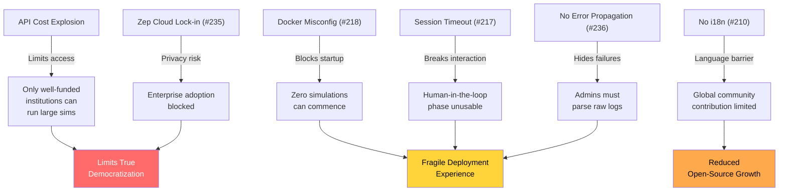

---

## 9. OASIS Engine Architecture

### OASIS Capability Matrix

| Capability | Specification |
|---|---|
| **Max Agent Scale** | 1,000,000 simultaneous agents |
| **Action Space** | 23 platform-specific social operations |
| **GPU Management** | Scalable Inferencer — multi-GPU load distribution |
| **Recommendation Systems** | Interest-based + hot-score-based algorithms |
| **Platform Archetypes** | Twitter/X (micro-blog) + Reddit (forum) |
| **Content Evaluation** | Dedicated AI models trained on empirical social data |
| **Developer** | CAMEL-AI research team |
| **License** | Open-source |

### The 23-Action Social Space (Representative)

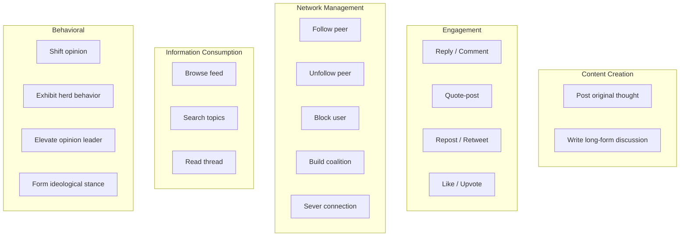

---

## 10. BettaFish Precursor Ecosystem

### Data Flow: BettaFish → MiroFish

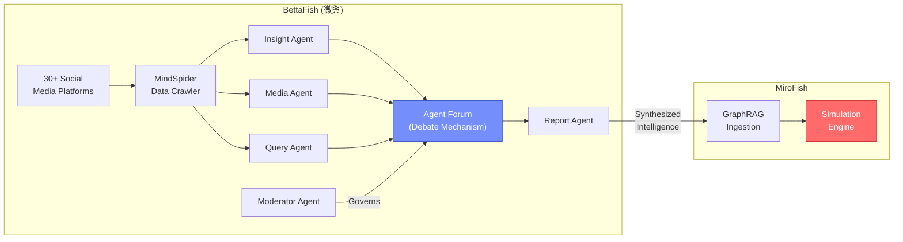

### Hallucination Case Study

> [!CAUTION]
> **Without MindSpider data crawler active**, the Insight Agent fabricated:
> - Fake maintenance costs: **480 RMB/hour** (entirely fictitious)
> - Non-existent government leaks from the **Ministry of Industry and Information Technology**
> - Fabricated technical hardware issues
>
> **Lesson**: If seed data is flawed/empty, MiroFish will *flawlessly extrapolate upon a hallucinated reality* — accurately predicting the outcome of a **fictional universe**.

---

## 11. Development & Methodology Analysis

### Vibe Coding Workflow

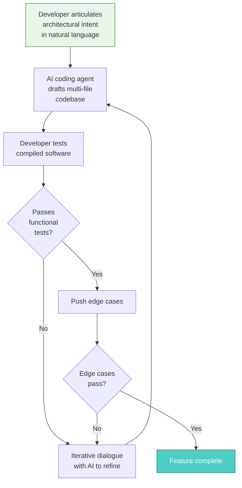

### Traditional vs. Vibe Coding vs. MiroFish Reality

| Dimension | Traditional Dev | AI-Assisted (Copilot) | Vibe Coding (MiroFish) |
|---|---|---|---|
| **Human Role** | Write every line | Write code with autocomplete suggestions | Articulate architectural "vibe" via natural language |
| **AI Role** | None | Suggest completions | Autonomously draft entire codebase |
| **Code Comprehension** | Line-by-line | Line-by-line with AI suggestions | Outcome observation + functional testing |
| **Team Size** | Enterprise teams | Engineering teams | **Single developer** |
| **Time for MiroFish** | Months–years | Weeks–months | **10 days** |
| **Debugging Method** | Manual syntax debugging | AI-assisted debugging | Edge case testing + iterative AI dialogue |

### Super-Individual Theory

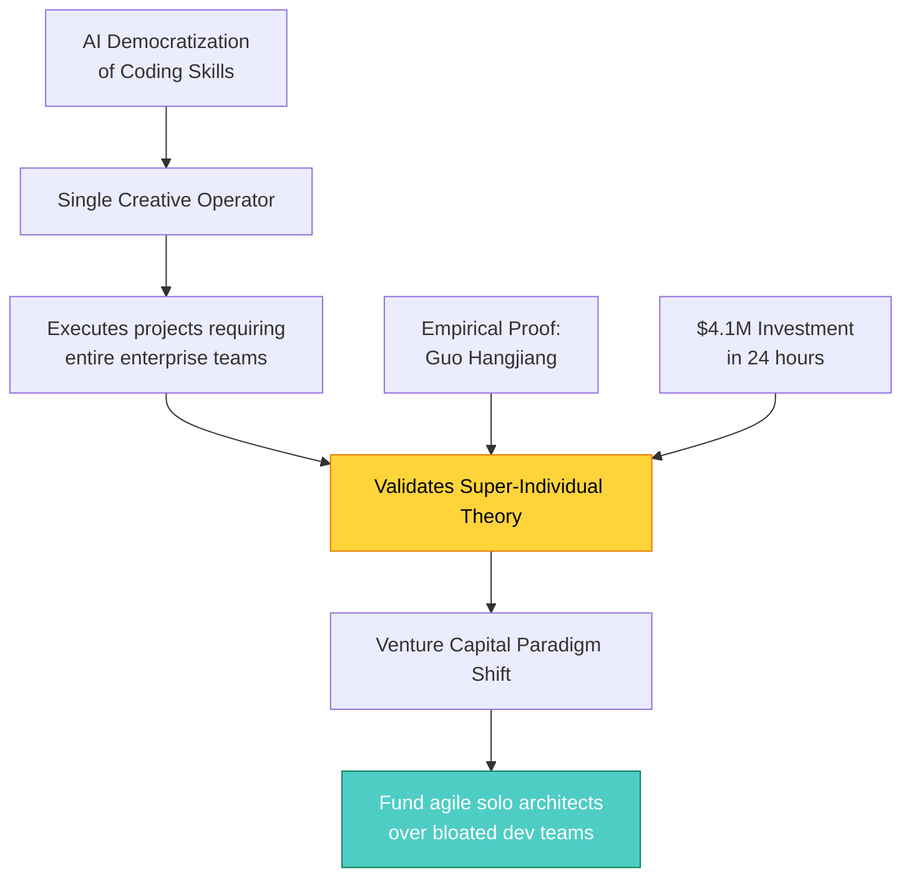

---

## 12. Adversarial Risk & Epistemic Limitations

### Risk Classification

| Risk Category | Description | Severity |
|---|---|---|
| **LLM Bias Inheritance** | All agents share systemic biases from LLM training data (worldview, safety filters, cultural biases) | 🔴 Fundamental |
| **Hallucination Propagation** | Flawed/empty seed data → simulation accurately predicts outcomes of a fictional universe | 🔴 Existential |
| **Weaponization Potential** | Engine can be used to test optimized psychological operations, disinformation campaigns, and panic injection strategies before real-world deployment | 🔴 Critical |
| **Deterministic Prediction Misuse** | Users may wrongly treat emergent macro-patterns as deterministic short-term forecasts (e.g., crypto prices) | 🟡 High |
| **Training Data Ceiling** | Real human behavior includes genuine novelty and irrational off-model reactions no dataset can capture | 🟡 Inherent |

### Adversarial Attack Flow

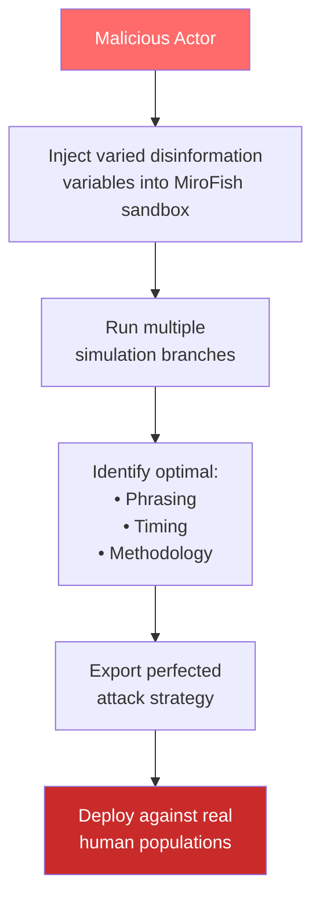

---

## 13. Key Metrics & Statistics

| Metric | Value |
|---|---|
| GitHub Stars | 30,000+ |
| Investment Secured | ¥30M (~$4.1M USD) |
| Time from Concept to #1 Trending | 10 days |
| Maximum Agent Population | 1,000,000 |
| Distinct Social Actions (OASIS) | 23 |
| BettaFish Platform Coverage | 30+ social media platforms |
| BettaFish Agent Types | 5 specialized archetypes |
| MiroFish Pipeline Phases | 5 |
| Simulation Platform Archetypes | 2 (Twitter/X + Reddit) |
| Recommended Max Rounds (Cost) | <40 |
| Developer Age | 20 years old (university senior) |
| Investor | Chen Tianqiao (Shanda Group founder) |
| LLM Recommended | Alibaba Qwen-plus |
| Frontend Port | 3000 |
| Backend API Port | 5001 |
| Python Version | 3.11–3.12 |
| Frontend Framework | Vue.js (Node.js 18+) |
| Open Issues Referenced | #210, #217, #218, #220, #235, #236 |
| Works Cited | 31 sources |

---

> [!TIP]
> **For Testing Teams**: MiroFish represents a paradigm where traditional unit/integration testing is insufficient. Testing this system requires:
> - **Emergent behavior validation** (statistical distribution of outcomes across N runs)
> - **Seed data integrity testing** (BettaFish crawler verification to prevent hallucination propagation)
> - **Agent persona consistency testing** (memory persistence across rounds)
> - **Adversarial red-teaming** (injection of adversarial seed data to test guardrails)
> - **Cost regression testing** (token consumption per simulation configuration)
